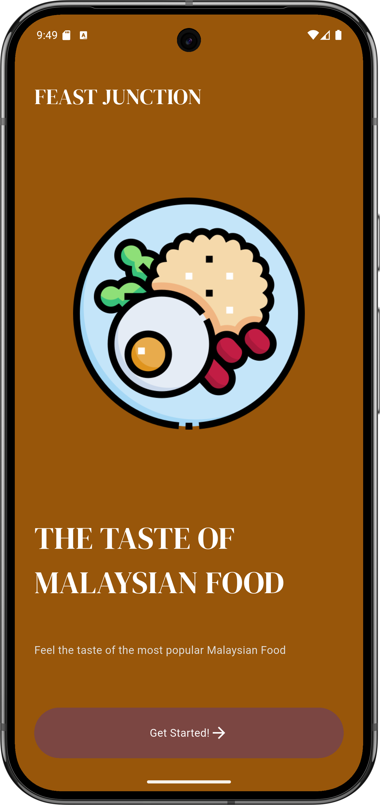
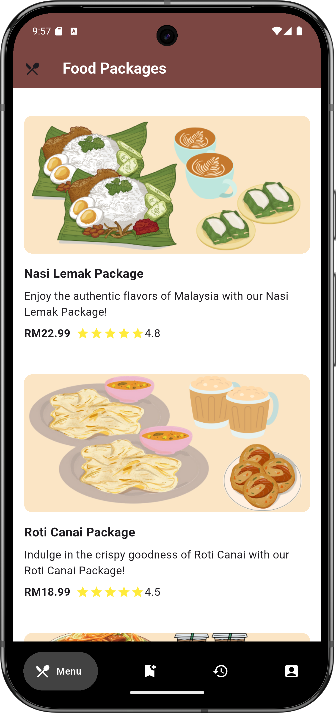
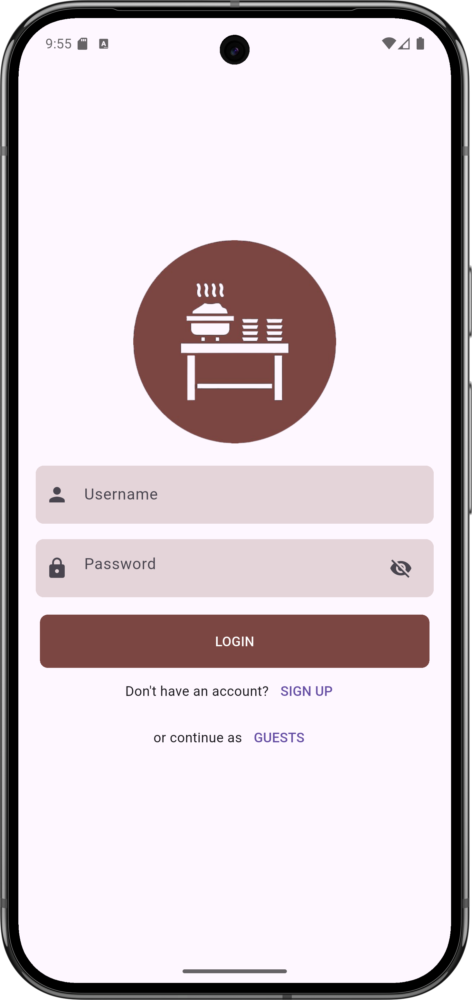
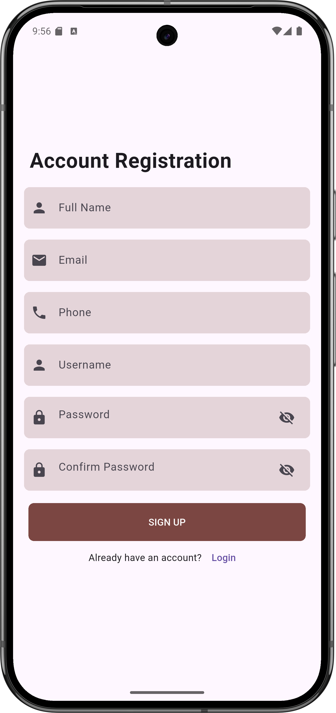
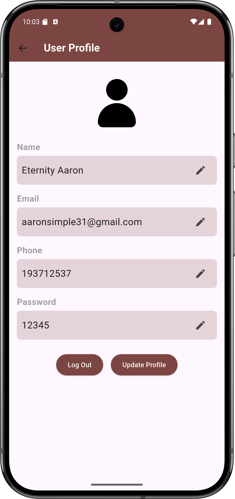
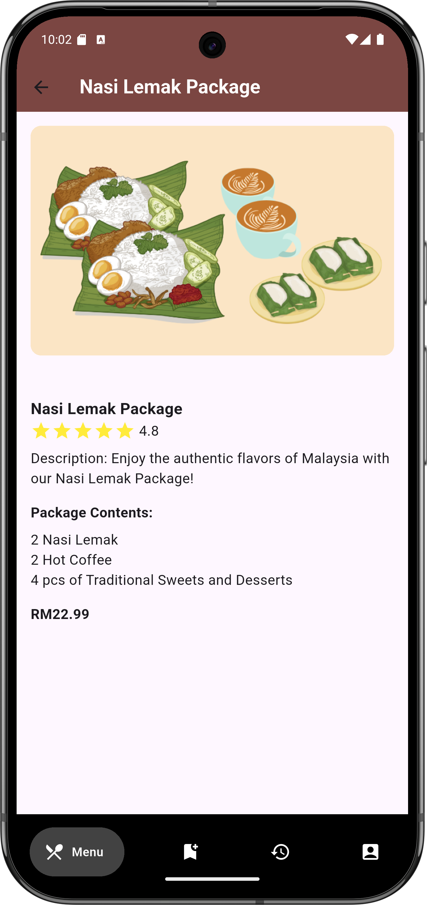
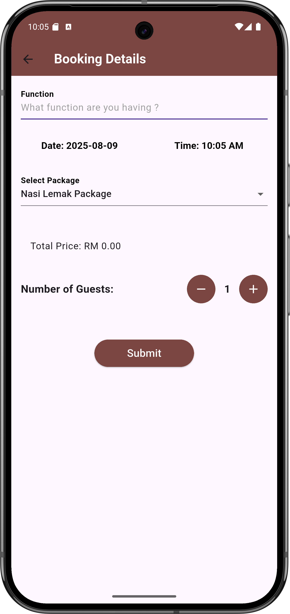
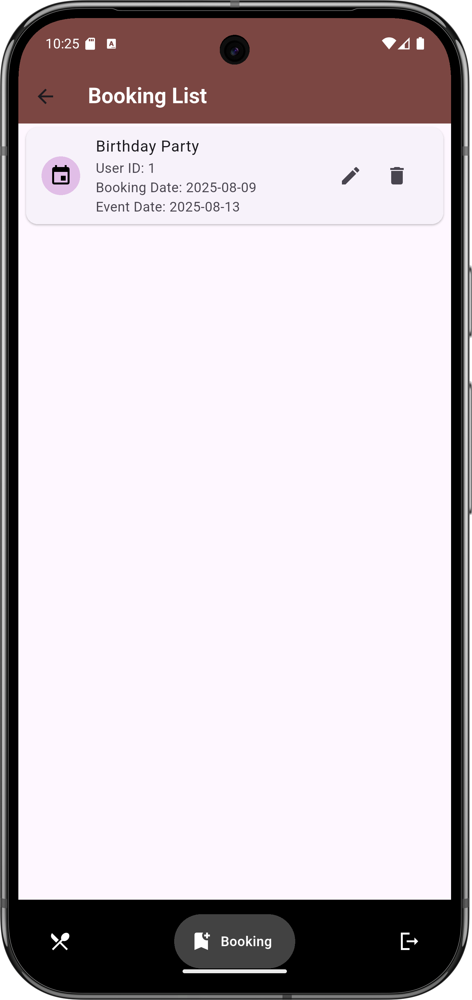
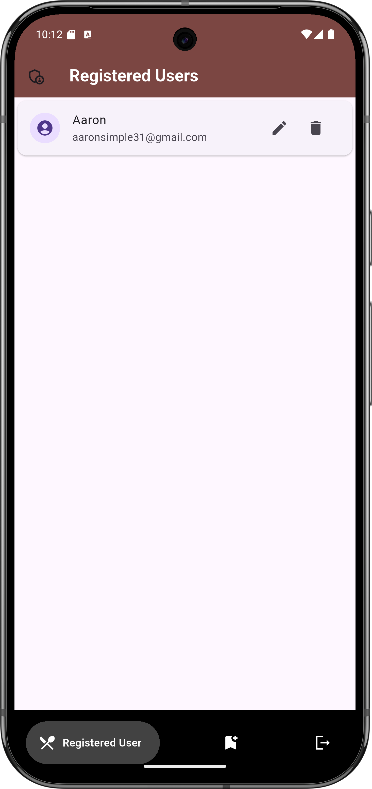

# Feast Junction - A Restaurant Menu Package Booking App

Welcome to the Feast Junction Menu Package Booking App! This Flutter application allows users to book restaurant menu packages for their events seamlessly. Both new and existing users can navigate through the app to register, book packages, and manage their bookings efficiently.

## Features

- **Front Page**: View the front page and menu packages.
- **Registration**: New users can register by providing a username and password.
- **Login**: Registered users can log in using their username and password.
- **User Profile**: Users can update their profile details (Name, email, phone, password).
- **Booking Form**: Fill in the booking form with details such as date, time, menu package, and number of guests.
- **View Bookings**: View booking details including date, time, menu package, and total price.
- **Manage Bookings**: Update or delete booking details.
- **Administrator Panel**: Admins can log in to view, update, and delete registered users and their bookings.

## Database Structure

### Database: restaurantpack

#### Table 1: users
| Column   | Type    |
|----------|---------|
| userId   | INTEGER |
| name     | TEXT    |
| email    | TEXT    |
| phone    | INTEGER |
| username | TEXT    |
| password | TEXT    |

#### Table 2: menubook
| Column      | Type    |
|-------------|---------|
| bookId      | INTEGER |
| userId      | INTEGER |
| bookdate    | DATE    |
| booktime    | TIME    |
| eventdate   | DATE    |
| eventtime   | TIME    |
| menupackage | TEXT    |
| numguests   | INTEGER |
| packageprice| DOUBLE  |

#### Table 3: administrator
| Column   | Type    |
|----------|---------|
| adminid  | INTEGER |
| username | TEXT    |
| password | TEXT    |

## User Requirements

### Non-registered User (Page 1)
- Display the front page of the app.
- View the menu packages.
- Users are required to register (username and password).

### Registered User (Page 2)
- Login (username and password).
- Update the user's profile (Name, email, phone, password).

### Registered User (Page 3)
- Fill in the booking form (Can choose more than one menu package).

### Registered User (Page 4)
- View booking date and time.
- View the event date, event time, menu package, number of guests, and total price.
- Update and delete the booking date, event date/event time, menu package, and number of guests.

### Administrator
- Login (username and password).
- View all registered users (Name, menu package, book date/time, event date/time).
- Update and delete registered users.
- Logout.

## Validation Messages
- **Empty Field Alert**: Please fill in all required fields.
- **Booking Confirmation**: Your booking has been confirmed!
- **Total Price Display**: The total price for the selected package is $XXX.XX.

## How to Run the Application
1. Clone the repository from GitHub.
2. Set up the database using the provided structure.
3. Run the application on your local server or emulator.
4. Navigate through the app as a user or administrator to explore all features.

## Getting Started with Flutter

This project is built with Flutter. If you're new to Flutter, here are some resources:

- [Lab: Write your first Flutter app](https://docs.flutter.dev/get-started/codelab)
- [Cookbook: Useful Flutter samples](https://docs.flutter.dev/cookbook)
- [Flutter documentation](https://docs.flutter.dev/)

## Screenshots

Here are some screenshots of the application:

| Front Page | Menu Packages |
|:----------:|:-------------:|
|  |  |
| **Home Screen View** | **Available Menu Packages** |

| Login Screen | Registration Screen |
|:------------:|:------------------:|
|  |  |
| **User Login** | **New User Registration** |

| Edit Profile | Package Details |
|:------------:|:--------------:|
|  |  |
| **Profile Management** | **Menu Package Information** |

| Booking Form | Booking List |
|:------------:|:------------:|
|  |  |
| **Create New Booking** | **View All Bookings** |

| Registered Users | Admin Booking List |
|:---------------:|:-----------------:|
|  |  |
| **User Management** | **Admin Booking Management** |

## About
This application was developed as an assignment for ISB26604 - Mobile and Ubiquitous Computing.